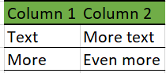

```{r setup, include=FALSE}
knitr::opts_chunk$set(
  echo = FALSE,
  message = FALSE,
  error = FALSE
)
```

# Option 1: Include table as an image

1. Draft and format table in Excel (e.g., manually and/or via Stata)
2. Save as PNG/JPG
3. Include in document via Markdown syntax



# Option 2: Extract from Word; reconstitute in R

```{r}
# load necessary libraries
library(officer)
library(tidyr)
library(dplyr)
library(flextable)

# input folder
dir <- "C:/Users/wb393438/LSMS-general/guidebook_formats/prototype_lsms_ebooks/handle_tables/inputs/"
doc <- "Agricultural Survey Design_5_5.docx"

# create docx object
ag_survey_design <- read_docx(path = paste0(dir, doc))
# create summary data frame
ag_summary <- docx_summary(ag_survey_design)
```


## Simple table

```{r}
# extract data for glossary in appendix III
table_iii_df <- dplyr::filter(ag_summary, doc_index == 495) %>%
    # convert from long to wide, bringing content into columns
    tidyr::pivot_wider(
        names_from = cell_id, 
        names_prefix = "col_", 
        values_from = text, 
        id_cols = row_id
    ) %>%
    select(-row_id) %>%
    slice(-1) %>%
    rename(
        Term = col_1,
        Description = col_2
    )

table_iii_tbl <- flextable::flextable(data = table_iii_df) %>%
    theme_zebra(odd_body = "#bbed9a") %>% 
    bg(bg = "#70AD47", part = 'header') %>%
    width(width = 3)

table_iii_tbl
```


```{r}

# extract and transform data for table 2
table2_df <- dplyr::filter(ag_summary, doc_index == 150) %>%
    # convert from long to wide, bringing content into columns
    tidyr::pivot_wider(
        names_from = cell_id, 
        names_prefix = "col_", 
        values_from = text, 
        id_cols = row_id
    ) %>%
    select(-row_id)

table2_tbl <- flextable::flextable(data = table2_df) %>% 
    # delete header
    delete_part(part = "header") %>%
    # inner and outer borders
    border_outer() %>% 
    border_inner() %>% 
    # post-harvest heading
    flextable::merge_at(i = 1, j = c(1, 2, 3)) %>% 
    align(i = 1, j = 1, align = 'center') %>% 
    bold(i = 1, j = c(1, 2, 3)) %>% 
    italic(i = 1, j = c(1, 2, 3)) %>% 
    # column labels
    bold(i = 2, j = c(1, 2, 3)) %>% 
    # PP 1 - Parcel Roster
    merge_at(i = c(3, 4), j = 1) %>% 
    valign(i = c(3, 4), j = 1) %>% 
    # PP 2 - Parcel Details
    merge_at(i = c(5, 6), j = 1) %>% 
    valign(i = c(5, 6), j = 1) %>% 
    # PP 3 - Plot Roster
    merge_at(i = c(7:9), j = 1) %>% 
    valign(i = c(7:9), j = 1) %>% 
    # PP 4 - Plot Details
    merge_at(i = c(10:11), j = 1) %>% 
    valign(i = c(10:11), j = 1) %>% 
    # PP 6 - Crop Roster
    merge_at(i = c(12:15), j = 1) %>% 
    valign(i = c(12:15), j = 1) %>%
    # Post-Harvest Questionnaire heading
    flextable::merge_at(i = 16, j = c(1, 2, 3)) %>% 
    align(i = 16, j = 1, align = 'center') %>% 
    bold(i = 16, j = c(1, 2, 3)) %>% 
    italic(i = 16, j = c(1, 2, 3)) %>%
    # column labels
    bold(i = 17, j = c(1, 2, 3)) %>% 
    # PH 7 - Field Crop Production
    merge_at(i = c(18:21), j = 1) %>% 
    valign(i = c(18:21), j = 1) %>% 
    # PH 8 - Field Crop Disposition
    merge_at(i = c(22:26), j = 1) %>% 
    valign(i = c(22:26), j = 1) %>%
    # bold first column
    bold(j = 1) %>%
    # expand third column
    width(j = 3, width = 3)

table2_tbl

```


