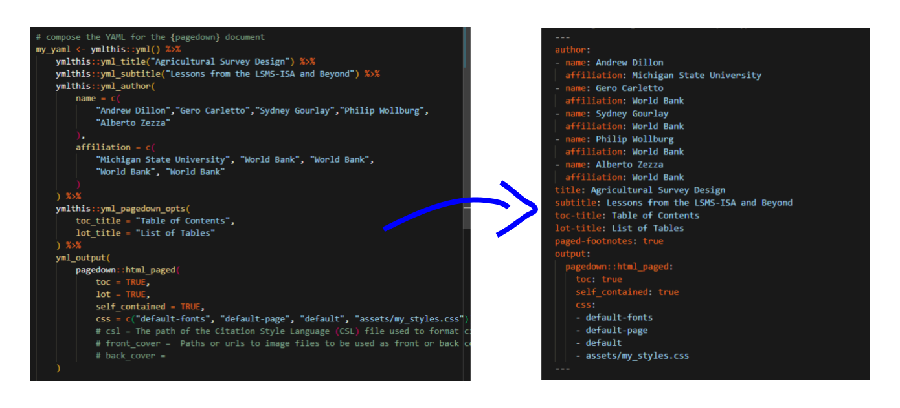
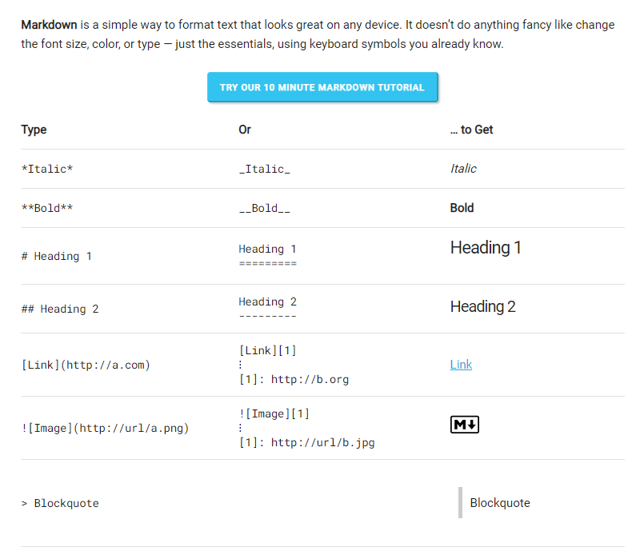
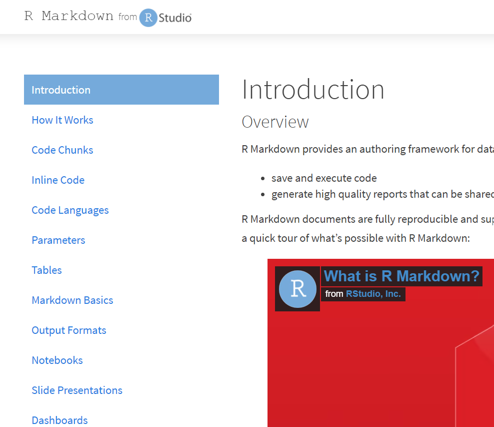
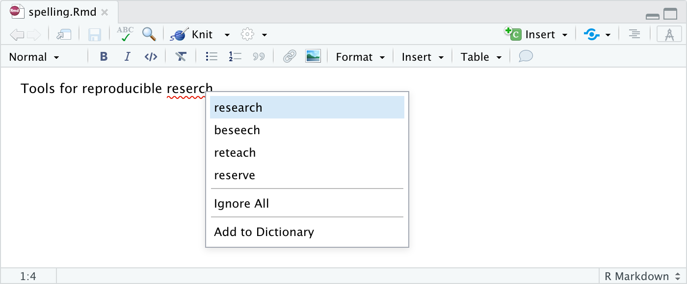

---

# Detailed process overview

---

# Word

.pull-left[
IMAGE OF WORD DOC
]

.pull-middle[
- Create content
- Collaborate
]

---

# RMarkdown

.pull-left[
VIDEO OF WORD TO MARKDOWN
]

.pull-right[
- Convert from Word to Markdown
]

---

layout: true

# RMarkdown

---

.pull-left[
VIDEO OF WORD TO MARKDOWN
]

.pull-right[
- Convert from Word to Markdown
- Clean up Markdown
    - Remove TOC, TOT, TOF
    - Remove tables, figures
- Provide tables and figures
- Convert from Markdown to:
    - {bookdown}
    - {pagedown}
]

---

.pull-left[
VIDEO OF WORD TO MARKDOWN
]

.pull-right[
- Convert from Word to Markdown
- Clean up Markdown
    - Remove TOC, TOT, TOF
    - Remove tables, figures
- Provide tables and figures
]

---

.pull-left[
VIDEO OF WORD TO MARKDOWN
]

.pull-right[
- Convert from Word to Markdown
- Clean up Markdown
    - Remove TOC, TOT, TOF
    - Remove tables, figures
- Provide tables and figures
- Convert from Markdown to:
    - {bookdown}
]

---

.pull-left[
VIDEO OF WORD TO MARKDOWN
]

.pull-right[
- Convert from Word to Markdown
- Clean up Markdown
    - Remove TOC, TOT, TOF
    - Remove tables, figures
- Provide tables and figures
- Convert from Markdown to:
    - {bookdown}
    - {pagedown}
]

---

# Publish

.pull-left[
VIDEO OF BUILDING {bookdown} WITH A CLICK
]

.pull-right[
- {bookdown}
]

---

.pull-left[
VIDEO OF BUILDING {pagedown} WITH A CLICK
]

.pull-right[
- {bookdown}
- {pagedown}
]

---

# Revise

.pull-left[
VIDEO OF MAKING CHANGE; OBTAINING NEW VERSIONS
]

.pull-right[
- Revise
- Rebuild
- Publish
]

---

# Next steps

---

# Overview

- Pilot
- Polish

---

# Pilot

.pull-left[
### To date
- Created Agricultural Survey Design
]

.pull-right[
### To do
- Research better tables
- Resolve some
]

---

# Polish

Refine process

Get help

---

# 

----

.panel[.panel-name[Rmd creation]

- Extract info from `r fontawesome::fa(name = "file-word")`
- Write YAML programmatically

]

---

.pull-left-3[
## .w-80.center[`r fontawesome::fa(name = "markdown")`]

.center[]

- Got 60s? Learn [here](https://commonmark.org/help/)
- Got 10m? Learn [here](https://commonmark.org/help/tutorial/)

]

--

.pull-middle-3[
### .w-20.center[]

- Start [here](https://rmarkdown.rstudio.com/lesson-1.html)  
- Dive deeper [here](https://rmd4medicine.netlify.app/slides/01-rmd-anatomy.html#1)

]

--

.pull-right-3[
### .w-30.center[]

- How
    + Open RStudio
    + Open RMarkdown document
    + Click one icon to write like in `r fontawesome::fa(name = "file-word")`
- Learn more [here](https://rstudio.github.io/visual-markdown-editing/#/)

]