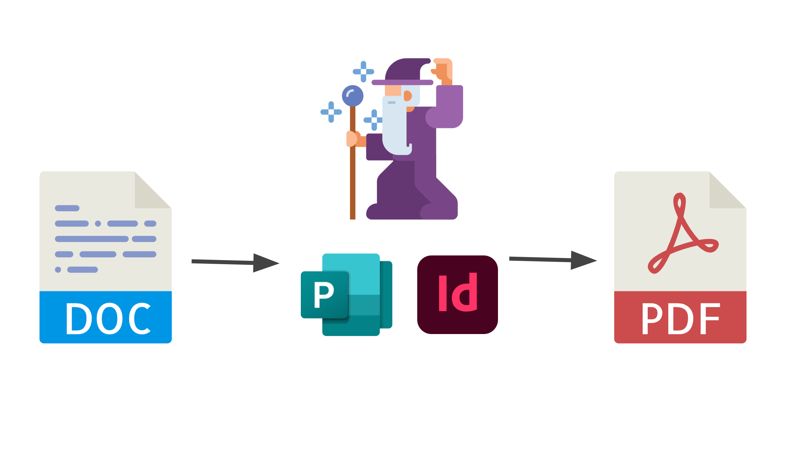
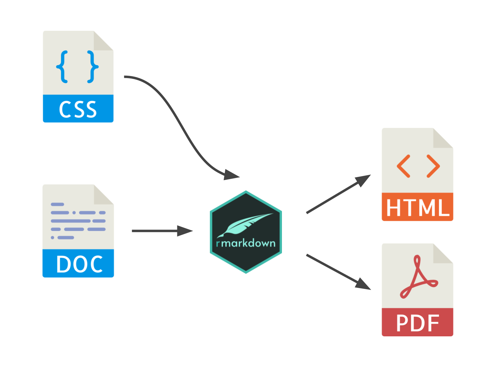
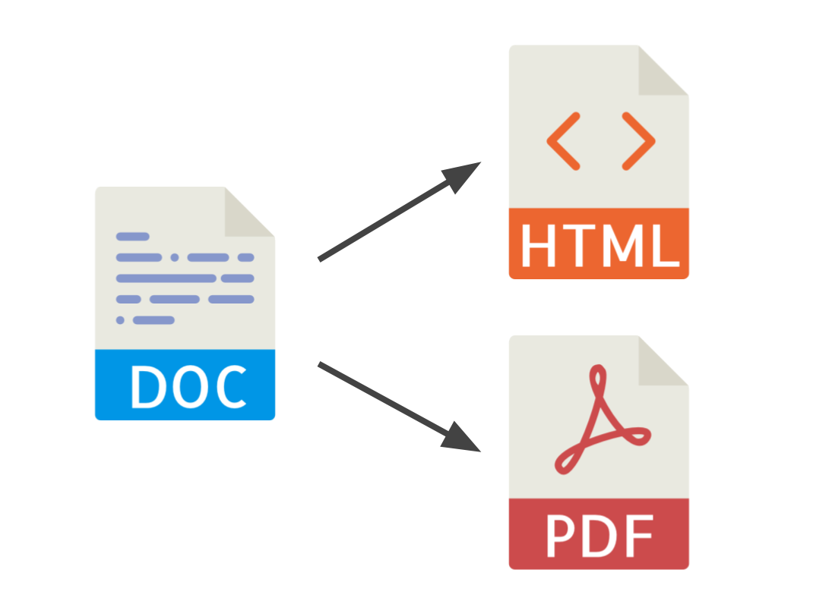
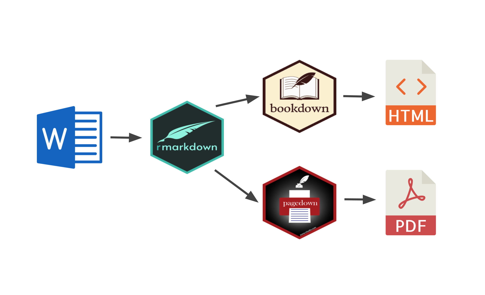
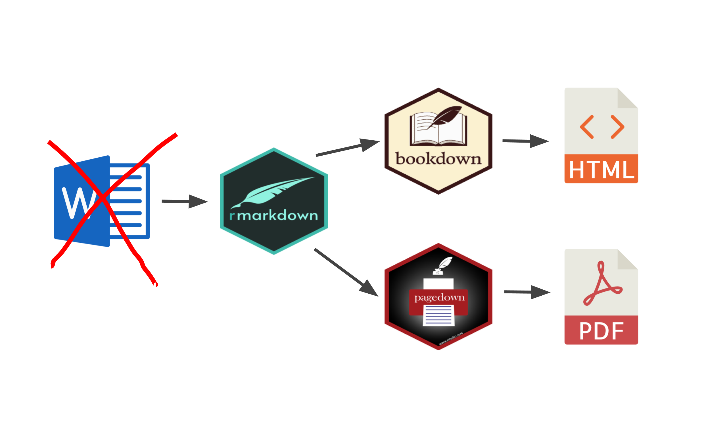
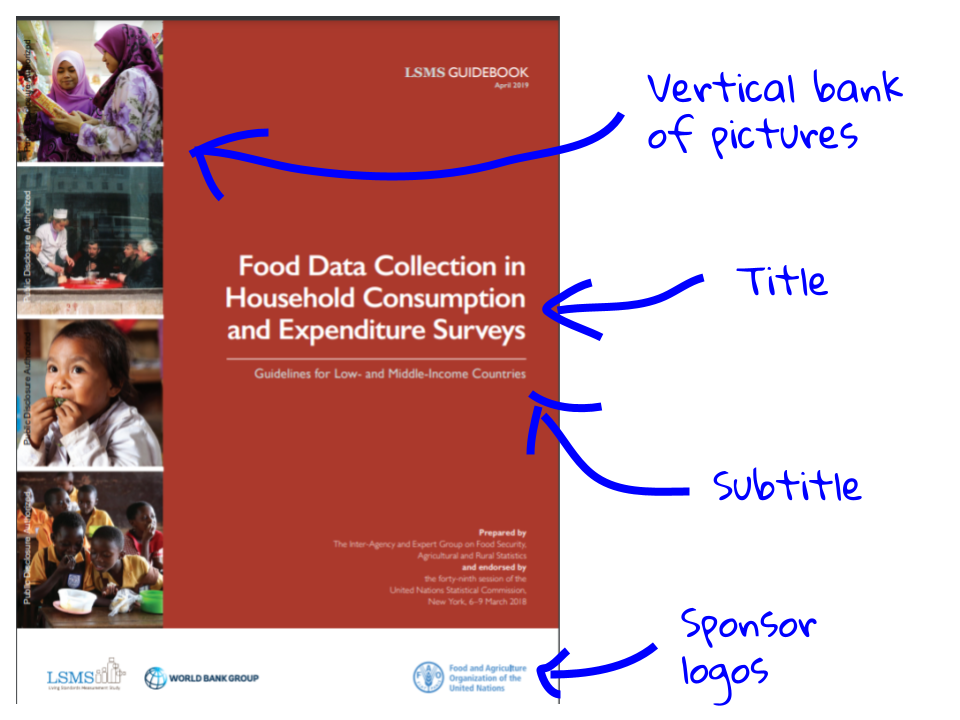
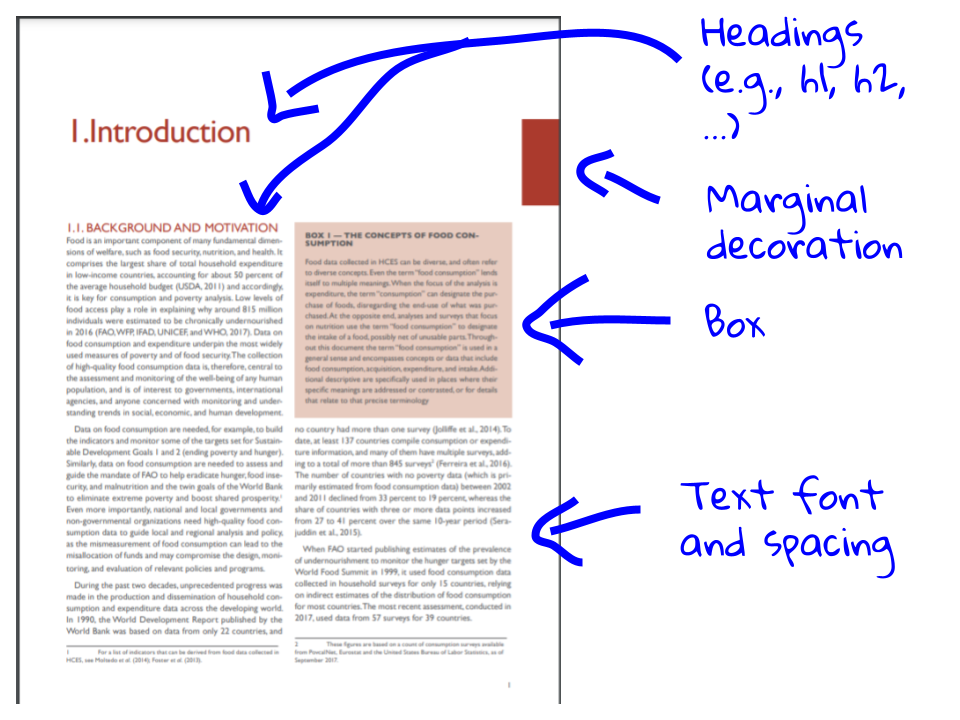
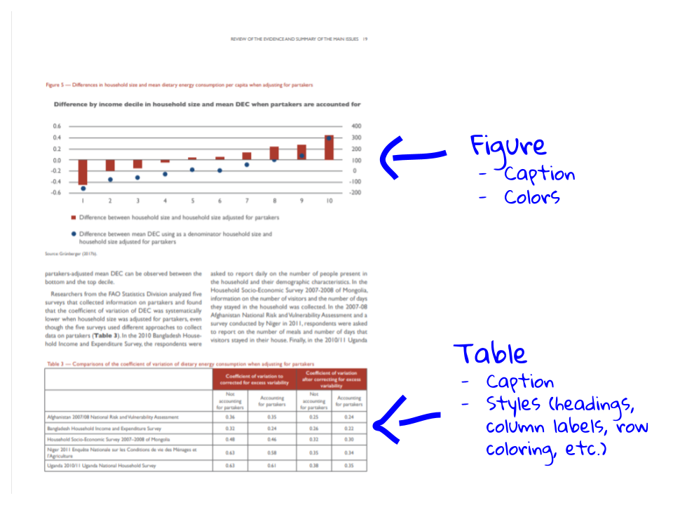
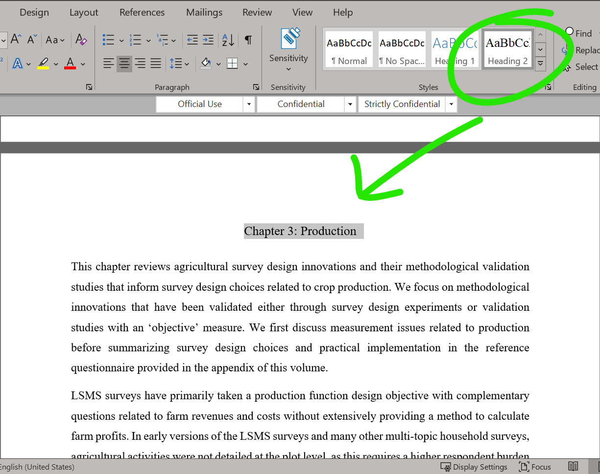
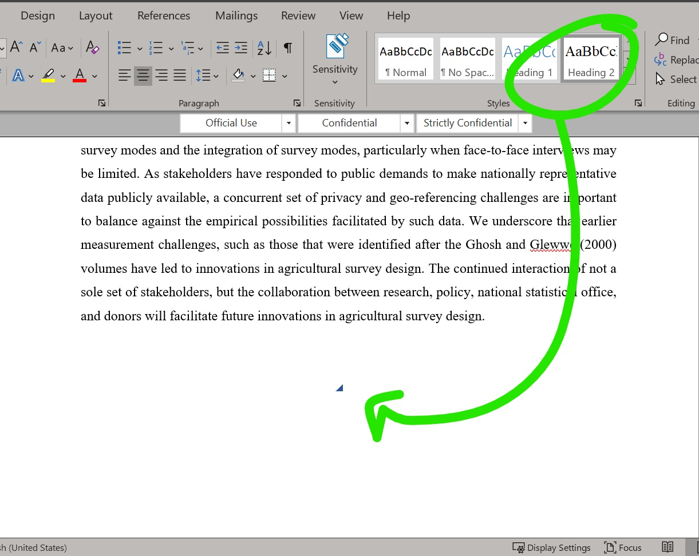

```{r knitr_options, include = FALSE, echo = FALSE, warning = FALSE, message = FALSE}

# knitr options
knitr::opts_chunk$set(
	eval = FALSE,
    echo = TRUE, 
	warning = FALSE,
	message = FALSE,
	out.width = '100%')

```

```{r load_libs, eval=TRUE, echo = FALSE}
library(xaringanExtra)
library(fontawesome)
library(emo)
```

```{r xaringan_extra, eval=TRUE, echo = FALSE}

xaringanExtra::use_panelset()
xaringanExtra::use_tachyons()

```

class: section-title-0, middle, center
background-image: url(assets/lsms_guidebook_mosaic.svg)
background-size: cover
background-color: white

# `r rmarkdown::metadata$title`
## with a little help from `r fontawesome::fa(name = "markdown", fill = "black")`


---

class: title, title-0

# Roadmap

<br><br>
.box-1.box-txt[Motivation]

.box-2.box-txt[Approach]

.box-3.box-txt[Discussion]

---

class: title, title-1

# Motivation

<br><br>
.box-1.box-txt[Make guidebooks more accessible]

.box-1.box-txt[Streamline publication process]

.box-1.box-txt[Make easier to update]

.box-1.box-txt[...and]

---

layout: true

class: title, title-1

# Make guidebooks more accessible

---

.left-column-bg[
<video width="1920" height="500" controls>
  <source src="assets/pdf_on_phone.mp4" type="video/mp4">
</video>
]

.right-column-sm[
- Hard to read on mobile device
    - Pinch
    - Squint
    - `r emo::ji("face_with_symbols_on_mouth")`
- Difficult to link
]

???

Linking = "See page 5."

---

.left-column-bg[
<video width="1920" height="500" controls>
  <source src="assets/bookdown_on_tablet.mp4" type="video/mp4">
</video>
]

.right-column-sm[
- Easier to read on mobile devices
    - tablet
]

---

.left-column-bg[
<video width="1920" height="500" controls>
  <source src="assets/bookdown_on_phone.mp4" type="video/mp4">
</video>
]

.right-column-sm[
- Easier to read on mobile devices
    - tablet
    - phone
]

---

.left-column-bg[
<video width="1920" height="500" controls>
  <source src="assets/easier_to_link.mp4" type="video/mp4">
</video>
]

.right-column-sm[
- Easier to read on mobile devices
    - tablet
    - phone
- Easier to link
]

---

.left-column-bg[
<video width="1920" height="500" controls>
  <source src="assets/other_cool_features.mp4" type="video/mp4">
</video>
]

.right-column-sm[
- Easier to read on mobile devices
    - tablet
    - phone
- Easier to link
- Other cool stuff
]

???

HTML video:
- Search
- Light/dark mode
- Get PDF

---

layout: false

layout: true

class: title, title-1

# Streamline publication process

---

.w-90.center.middle[

]

???

[Create content] -> [Designer magic happens] -> [Publish]

Steps not shown:

- Wait for designer feedback
- Chase designer to finish

---

.w-70.center.middle[

]

???

Prospective process

[Develop styles] 

[Create content] -> [Apply styles] -> [Publish]

---

<video width="1920" height="500" controls>
  <source src="assets/publish_and_revise.mp4" type="video/mp4">
</video>

---

layout: false

layout: true

class: title, title-1

# Keeping up with the (Maria) Joneses

---

.small.center[https://bit.ly/drip-book]

<video width="1920" height="500" controls>
  <source src="assets/dime_book_pdf.mp4" type="video/mp4">
</video>

---

.small.center[https://worldbank.github.io/dime-data-handbook/]

<video width="1920" height="500" controls>
  <source src="assets/dime_book_ui.mp4" type="video/mp4">
</video>

---

.small.center[https://github.com/worldbank/dime-data-handbook]

<video width="1920" height="500" controls>
  <source src="assets/dime_book_codecode.mp4" type="video/mp4">
</video>

---

layout: false

class: section-title-2, center, middle, inverse

# Approach

---

class: title, title-2

# Approach

<br><br>

.box-2.box-txt[Proposal]

.box-2.box-txt[Prototypes]

.box-2.box-txt[Polishing]


---

class: section-title-2, center, middle, inverse

# Proposal

---

layout: true

class: title, title-2

---

# Objective

.w-60.center[

]
---

# Short-term

.w-90.center[

]

???

[Word] -> [RMarkdown]   -> [{bookdown}] -> [HTML]
                        -> [{pagedown}] -> [PDF]


---

# Long-term

.w-90.center[

]

???

~~[Word]~~ -> [RMarkdown]   -> [{bookdown}] -> [HTML]
                        -> [{pagedown}] -> [PDF]

---

layout: false

class: section-title-2, center, middle, inverse

# Prototypes

---

layout: true

class: title, title-2

---

# HTML

.center[https://ag-ex-bookdown.netlify.app]

```{r echo = FALSE, eval=TRUE}
knitr::include_url("https://ag-ex-bookdown.netlify.app/", height = "500px")
```

---

# HTML

.center[https://lsms-bookdown-example.netlify.app]

```{r echo = FALSE, eval=TRUE}
knitr::include_url("https://lsms-bookdown-example.netlify.app", height = "450px")
```

---

# PDF

.center[https://lsms-pagedown-example.netlify.app]

```{r echo = FALSE, eval=TRUE}
knitr::include_url("https://lsms-pagedown-example.netlify.app", height = "450px")
```

---

# PDF

.center[https://ag-ex-pagedown.netlify.app]

```{r echo = FALSE, eval=TRUE}
knitr::include_url("https://ag-ex-pagedown.netlify.app", height = "450px")
```

---

layout: false

class: section-title-2, center, middle, inverse

# Polishing

---

layout: true

class: title, title-2

---

# Polishing

<br><br>
.box-2.box-txt[Develop styles `r fontawesome::fa(name = "palette")`]

.box-2.box-txt[Refine process `r fontawesome::fa(name = "cogs")`]

.box-2.box-txt[Train staff `r fontawesome::fa(name = "chalkboard-teacher")`]

???

- Develop styles
    - 
- Refine production pipeline
    - 
- Staff training
    - Markdown
    - RMarkdown
    - Portable tables

---

layout: true

class: title, title-2

# Develop design `r fontawesome::fa(name = "palette")`

---

.w-70.center[

]

---

.w-70.center[

]

---

.w-70.center[

]

---

layout: false

class: title, title-2

# Replicate design `r fontawesome::fa(name = "palette")`

.pull-left[
### .center[Option 1: Learn (enough)]

.w-80.center[

]

]

--

.pull-right[
### .center[Option 2: Hire an expert]

.w-80.center[

]

]

---

class: title, title-2

# Refine pipeline `r fontawesome::fa(name = "cogs")`

.panelset[

.panel[.panel-name[Handle tables]

<video width="1920" height="500" controls>
  <source src="assets/handling_tables_options.mp4" type="video/mp4">
</video>

]

.panel[.panel-name[Include questionnaire]

### Options to explore

- Automate screenshots of each tab
- Print Excel qnr to PDF; include PDF
- Link to external source

]

.panel[.panel-name[Check Word inputs]

.pull-left[
### No H1 headings



]

.pull-right[
### Orphan headings



]

]

.panel[.panel-name[Check outputs]

### Options to explore

- Recurrent tests
    - Number of pages/words correct
    - Styles correctly applied
- Bespoke needs
]

]

???

- Tables
    - Extract from Word
    - Produce from alternate source
- Streamline Rmd creation
    - Write YAML
- Check input
    - No H1 headings
    - Empty headings
- Check output(s)

---

class: title, title-2

# Staff training (over time) `r fontawesome::fa(name = "chalkboard-teacher")`

.panelset[

.panel[.panel-name[Markdown]

.left-column-bg[
```{r, echo=FALSE, eval=TRUE}
knitr::include_url("https://commonmark.org/help/")
```
]

.right-column-sm[
- Got 60s? Learn [here](https://commonmark.org/help/)
- Got 10m? Learn [here](https://commonmark.org/help/tutorial/)
]

]

.panel[.panel-name[RMarkdown]

.left-column-bg[
```{r, echo = FALSE, eval = TRUE}
knitr::include_url("https://rmarkdown.rstudio.com/lesson-1.html")
```
]

.right-column-sm[
- Start [here](https://rmarkdown.rstudio.com/lesson-1.html) <br>
- Dive deeper [here](https://rmd4medicine.netlify.app/slides/01-rmd-anatomy.html#1)
]

]

.panel[.panel-name[RStudio]

.left-column-bg[

]

.right-column-sm[
- How
    + Open RStudio
    + Open RMarkdown document
    + Click one icon to write like in `r fontawesome::fa(name = "file-word")`
- Learn more [here](https://rstudio.github.io/visual-markdown-editing/#/)
]

]

]

---

layout: false

class: section-title-3, center, middle, inverse

# Discussion

---

layout: true

class: title, title-3

---

# Questions for me

.center.middle[
<iframe src="https://giphy.com/embed/xT5LMB2WiOdjpB7K4o" width="480" height="362" frameBorder="0" class="giphy-embed" allowFullScreen></iframe><p><a href="https://giphy.com/gifs/season-17-the-simpsons-17x6-xT5LMB2WiOdjpB7K4o"></a></p>
]

---

# Questions for us

.center.middle[
<iframe src="https://giphy.com/embed/WqLmcthJ7AgQKwYJbb" width="480" height="480" frameBorder="0" class="giphy-embed" allowFullScreen></iframe><p><a href="https://giphy.com/gifs/leroypatterson-WqLmcthJ7AgQKwYJbb"></a></p>
]

---

# Questions for us

- Worth doing?

--

- Which output formats to target?

--

- What path to transition?

--

- Bring in outside help?
